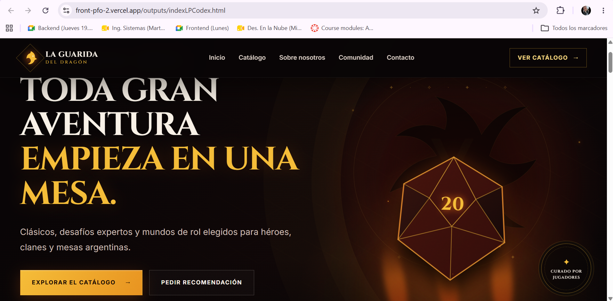
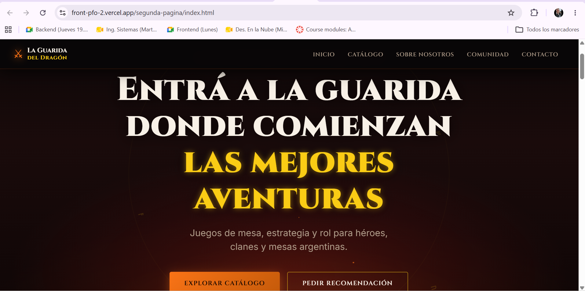

# Proyecto de Landing Pages con IA

> Comparación de dos landing pages generadas por distintos agentes de inteligencia artificial a partir de una misma consigna.


## Datos del estudiante

| Dato | Información |
|---|---|
| **Estudiante** | Facal Ximena |
| **Institución** | Instituto Superior de Formación Técnica N.º 29 |
| **Trabajo** | Práctica Formativa Obligatoria 2 |
| **Año** | 2026 |
| **Carrera / Comisión** | Tecnicatura Superior en Desarrollo de Software | Comisión D |

## Deploy unificado

<!-- TODO: reemplazar la URL siguiente por el enlace definitivo de Vercel. Debe dirigir a la portada principal. -->

🔗 **[Ver el proyecto publicado en Vercel](https://front-pfo-2.vercel.app/)**

El deploy abre una portada única desde la cual se puede acceder al prompt original y a las dos landing pages generadas.

## Contenido del proyecto

| Recurso | Agente / modelo | Acceso local |
|---|---|---|
| Prompt utilizado | Consigna común | [Ver archivo](./prompt-utilizado.txt) |
| Landing Page — Primer agente | Codex / GPT-5.5 | [Abrir landing](./outputs/indexLPCodex.html) |
| Landing Page — Segundo agente | Claude / Sonnet 4.6 | [Abrir landing](./segunda-pagina/index.html) |

## Prompt exacto utilizado

<details>
<summary><strong>Ver prompt completo</strong></summary>

```text
# Rol y objetivo

Actuá como un/a diseñador/a UI/UX senior y desarrollador/a front-end especializado/a en landing pages comerciales de alto impacto visual.

Necesito que generes una landing page completa para una tienda ficticia argentina de juegos de mesa, juegos de estrategia y juegos de rol con estética dark fantasy, inspirada en mundos tipo Dungeons & Dragons, fantasía medieval, fuego, tabernas, mazmorras, grimorios, dados, dragones y estilo gótico.

La página debe estar orientada a la venta de juegos de mesa y juegos de rol para público argentino.

# Nombre y concepto de la marca

Nombre sugerido: **La Guarida del Dragón**

Concepto: una tienda especializada en juegos de mesa modernos, juegos expertos, juegos cooperativos, juegos de rol y aventuras narrativas. La marca debe sentirse como una mezcla entre tienda gamer, taberna medieval y refugio para jugadores expertos.

Tono de comunicación: épico, atractivo, comercial, pero no exageradamente infantil. Debe invitar a comprar, explorar el catálogo y sumarse a una comunidad de jugadores.

# Requisitos obligatorios de estructura

La landing page debe incluir sí o sí estas secciones:

1. **Header / Cabecera**

   * Logo o nombre de la marca.
   * Menú de navegación con anclas internas.
   * Links sugeridos: Inicio, Catálogo, Sobre nosotros, Comunidad, Contacto.
   * Debe ser responsive.
   * Puede tener efecto sticky o sombra sutil.

2. **Hero Section**

   * Título impactante.
   * Subtítulo breve.
   * Botón CTA principal.
   * Botón secundario opcional.
   * Estética visual fuerte: fuego, sombras, brillo naranja/rojo, textura oscura, fantasía medieval.
   * Debe comunicar rápidamente que es una tienda argentina de juegos de mesa y rol.

3. **Descripción / Sobre Nosotros**

   * Explicar que la tienda reúne juegos familiares, expertos y de rol.
   * Mencionar que está pensada para jugadores de Argentina.
   * Incluir una propuesta de valor: asesoramiento, preventas, juegos importados/editoriales reconocidas, comunidad y recomendaciones según nivel.

4. **Servicios / Características principales / Catálogo**

   * Esta sección debe funcionar como catálogo visual de productos.
   * Incluir tarjetas de juegos con nombre, breve descripción, precio en pesos argentinos, etiqueta de tipo de juego y botón de compra o consulta.
   * Usar moneda argentina con formato claro: `$57.500 ARS`, `$199.000 ARS`, etc.
   * Los precios deben mostrarse como “desde” o “precio de referencia”, porque la página es maquetada y no tendrá backend real.
   * Juegos sugeridos para incluir:

     * Catan: El Juego — desde $57.500 ARS.
     * Catan: ampliación 5-6 jugadores — desde $34.600 ARS.
     * Carcassonne — desde $41.700 ARS.
     * Carcassonne Big Box — desde $79.200 ARS.
     * El Señor de los Anillos: Destino de la Comunidad — desde $199.000 ARS.
     * SETI — desde $173.600 ARS.
     * Azul / Azul Duel — desde $64.800 ARS.
     * Dungeon Fighter — desde $54.300 ARS.
     * Onirim — desde $32.700 ARS.
     * Opcional: juegos de rol como Dragonbane, Daggerheart, Pathfinder, El Señor de los Anillos 5e o Warhammer Fantasy, con precio “consultar”.
   * Incluir filtros visuales o etiquetas como: Estrategia, Cooperativo, Familiar, Experto, Rol, Fantasía, Sci-Fi.
   * Si el entorno permite usar imágenes externas, usá imágenes relevantes con `alt` descriptivo.
   * Si no se puede garantizar el uso de imágenes reales o con licencia, generá placeholders visuales elegantes con CSS: cartas oscuras, dados, meeples, runas, dragones, tableros, fuego y bordes ornamentales.

5. **Testimonios / Reseñas**

   * Incluir 3 testimonios ficticios de clientes argentinos.
   * Deben sonar naturales.
   * Ejemplos de perfiles: jugador experto, grupo de amigos, persona que compró su primer juego.
   * Pueden tener nombres ficticios, estrellas o una frase destacada.

6. **Formulario de contacto**

   * Formulario visual, no necesita backend.
   * Campos: Nombre, Email, Tipo de consulta, Mensaje.
   * El campo “Tipo de consulta” puede tener opciones como: Comprar un juego, Recomendación, Juegos de rol, Preventa, Otro.
   * Botón CTA: “Enviar mensaje al gremio” o similar.
   * Agregar microcopy aclarando que es una maqueta visual.
   * Si usás JavaScript, podés simular un mensaje de confirmación sin enviar datos reales.

7. **Footer**

   * Nombre de la marca.
   * Links internos.
   * Redes sociales ficticias: Instagram, WhatsApp, Discord, YouTube.
   * Texto legal simple: “Precios de referencia. Sitio ficticio desarrollado con fines académicos.”
   * Mantener la estética dark fantasy.

# Estilo visual

La estética debe ser oscura, gótica y fantástica, con sensación de fuego y aventura.

Usar una paleta similar a:

* Negro carbón: `#080506`
* Bordó oscuro: `#1a0b0b`
* Rojo sangre: `#5b0f0f`
* Naranja fuego: `#f97316`
* Dorado antiguo: `#facc15`
* Gris piedra: `#2f2f35`
* Texto claro: `#f8f1e7`

Dirección visual:

* Fondo oscuro con gradientes suaves.
* Brillos tipo fuego.
* Bordes dorados o cobrizos.
* Cards con sombras profundas.
* Botones con hover brillante.
* Detalles de runas, dados, dragones, espadas o pergaminos, preferentemente generados con CSS o iconografía simple.
* Tipografía: combinar una fuente serif o display para títulos con una sans-serif legible para textos. Si usás Google Fonts, elegir algo similar a `Cinzel`, `MedievalSharp`, `Uncial Antiqua`, `Inter` o `Montserrat`. Si no hay acceso externo, usar fallbacks seguros.

Evitar:

* Una landing genérica tipo startup SaaS.
* Fondos blancos predominantes.
* Diseño demasiado infantil.
* Exceso de texto.
* Imágenes rotas.
* Cards desalineadas.
* Botones sin contraste.
* Texto placeholder tipo “Lorem ipsum”.

# Requisitos técnicos

Generá una landing page responsive y prolija.

Si estás trabajando en un entorno con archivos, creá o editá estos archivos:

* `index.html`
* `styles.css`
* `script.js`

Si no podés crear archivos, devolvé el código completo separado por archivo.

Usar preferentemente:

* HTML semántico.
* CSS moderno.
* JavaScript vanilla simple.
* Sin backend.
* Sin frameworks obligatorios.
* Si usás librerías externas, que sean mínimas y justificadas.

La página debe:

* Verse bien en desktop, tablet y mobile.
* Tener navegación por anclas.
* Tener estados hover/focus.
* Tener buen contraste.
* Usar `alt` en imágenes.
* Tener estructura accesible básica.
* Tener cards de productos claras.
* Mostrar precios en pesos argentinos.
* Incluir CTAs visibles.

# Contenido sugerido

Podés usar o adaptar estos textos:

Hero title:
“Entrá a la guarida donde comienzan las mejores aventuras”

Hero subtitle:
“Juegos de mesa, estrategia y rol para héroes, clanes y mesas argentinas.”

CTA principal:
“Explorar catálogo”

CTA secundario:
“Pedir recomendación”

Sobre nosotros:
“En La Guarida del Dragón reunimos juegos familiares, expertos y de rol para que cada mesa encuentre su próxima aventura. Desde clásicos como Catan y Carcassonne hasta campañas narrativas, cooperativos épicos y desafíos para jugadores exigentes.”

Beneficios:

* Juegos seleccionados por nivel de experiencia.
* Recomendaciones para grupos, parejas y campañas de rol.
* Catálogo con títulos familiares, expertos, cooperativos y narrativos.
* Comunidad para descubrir nuevas partidas.

Testimonios ficticios:

* “Compré Catan para jugar con amigos y terminé sumando expansiones. Me asesoraron muy bien.” — Martín, CABA.
* “Buscaba algo más experto y me recomendaron SETI. Excelente experiencia.” — Laura, Quilmes.
* “Arrancamos con rol por primera vez y nos guiaron con manuales y dados. Súper claro.” — Nico, Lanús.

# Interacción opcional

Agregar en JavaScript:

* Botón de menú hamburguesa en mobile.
* Simulación de envío del formulario con un mensaje visual.
* Botones de producto que muestren un mensaje tipo “Producto agregado a la lista de consulta”.
* Scroll suave para navegación interna.

# Criterios de éxito

Antes de finalizar, verificá que:

1. La landing incluye header, hero, sobre nosotros, catálogo/servicios, testimonios, formulario y footer.
2. La estética es dark fantasy/gótica con fuego, no una página genérica.
3. Hay juegos concretos con precios en ARS.
4. La página está orientada a Argentina.
5. El catálogo incluye Catan, Carcassonne, El Señor de los Anillos, SETI, Azul/Azul Duel y juegos de rol o expertos.
6. El formulario está maquetado visualmente.
7. El diseño es responsive.
8. No hay imágenes rotas.
9. No hay texto “Lorem ipsum”.
10. El código está ordenado, comentado solo donde sea útil y listo para ejecutar.

# Entrega esperada

Implementá directamente la landing page.

Al finalizar, entregá:

1. Una breve explicación de qué se creó.
2. La lista de archivos generados o modificados.
3. Cualquier aclaración importante, por ejemplo si las imágenes son placeholders o si los precios son de referencia.
```

</details>

## Capturas de pantalla

### Landing Page — Primer agente: Codex / GPT-5.5

<!--
TODO: guardar aquí una captura real de la primera landing:
docs/capturas/landing-codex.png
-->



### Landing Page — Segundo agente: Claude / Sonnet 4.6

<!--
TODO: guardar aquí una captura real de la segunda landing:
docs/capturas/landing-claude.png
-->



## Estructura

```text
.
├── index.html                    # Portada unificada
├── styles.css                    # Estilos de la portada
├── script.js                     # Interacciones de la portada
├── prompt-utilizado.txt          # Prompt original
├── outputs/
│   ├── indexLPCodex.html         # Landing del primer agente
│   ├── styles.css
│   └── script.js
├── segunda-pagina/
│   ├── index.html                # Landing del segundo agente
│   ├── styles.css
│   └── script.js
└── docs/
    └── capturas/
        ├── landing-codex.png
        └── landing-claude.png
```

## Ejecución local

No requiere instalación ni dependencias:

1. Clonar o descargar el repositorio.
2. Abrir `index.html` en un navegador.
3. Usar la portada para acceder al prompt y a ambas landing pages.

También puede ejecutarse con la extensión **Live Server** de Visual Studio Code.

## Tecnologías

- HTML5 semántico.
- CSS3 responsive.
- JavaScript vanilla.
- Inteligencia artificial aplicada a generación y comparación de interfaces.

---

Trabajo académico desarrollado para **Práctica Formativa Obligatoria 2** — ISFT N.º 29.

